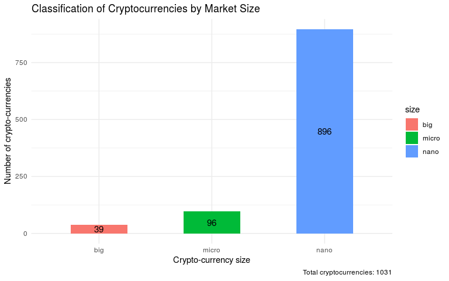

# 1. Getting the data from web

First, we will load the data from the [coinmarketcap API](https://api.coinmarketcap.com/) and display it in the output.


```r
# set working directory
setwd("/home/bjungbogati/Desktop/DataSansar/Projects/bitcoin_market")

# import json data from web
library(jsonlite)
library(httr)

json_data <- fromJSON("https://api.coinmarketcap.com/v1/ticker")

# write.csv(json_data, file="crypcoins.csv", row.names=FALSE)

# create table with top 3 rows with 8 columns
library(knitr)
kable(head(json_data, 3)[1:8])
```


id         name       symbol   rank   price_usd   price_btc    24h_volume_usd   market_cap_usd 
---------  ---------  -------  -----  ----------  -----------  ---------------  ---------------
bitcoin    Bitcoin    BTC      1      7482.44     1.0          3398960000.0     128427290733   
ethereum   Ethereum   ETH      2      468.849     0.0628978    1324600000.0     47283293478.0  
ripple     XRP        XRP      3      0.454997    0.00006097   144148000.0      17888518035.0  

# 2. Working with a reproducible dataset

The above data is limited and changes on daily basis, so we work with a particular dataset which is reproducible. Here, we use data from coinmarketcap.com dated on Dec 6, 2017.  


```r
# read the datasets 
dec6 <- read.csv("./datasets/coinmarketcap_06122017.csv", stringsAsFactors = F)

# selecting the 'id' and 'market_cap_usd' columns
market_cap_raw <- dec6[c('id', 'market_cap_usd')]

# counting row and missing values

nrow(market_cap_raw) # 1326 - total rows
```

```
## [1] 1326
```

```r
sum(is.na(market_cap_raw)) # 295 - missing value
```

```
## [1] 295
```

# 3. Discard the cryptocurrencies without a market capitalization

From above we find, market_cap_usd have 295 missing values. Here, we don't deal with the cryptocurrency which don't have market capitalization.


```r
# filter out the rows without a market capitalization

cap = na.omit(market_cap_raw)
nrow(cap)
```

```
## [1] 1031
```

# 4. How big is Bitcoin compared with the rest of the currencies ?

Bitcoin is under heavy competition with other competitors. Still, it's dominant in market capitalization. Now, we compare the top 10 coins with their market share. 


```r
# used in the plots below
top_cap_title <- "Top 10 market capitalization"
top_cap_ylabel <- "% of total cap"

# select first 10 rows and set the index
cap10 <- head(cap, 10)
rownames(cap10) <- NULL

# calculate market_cap_perc
library(dplyr)
```

```
## 
## Attaching package: 'dplyr'
```

```
## The following objects are masked from 'package:stats':
## 
##     filter, lag
```

```
## The following objects are masked from 'package:base':
## 
##     intersect, setdiff, setequal, union
```

```r
cap10 <- cap10 %>% 
  mutate(market_cap_perc = market_cap_usd/sum(cap['market_cap_usd'])*100)

total_market_cap <- round(sum(cap$market_cap_usd)/ 100000000)

library(ggplot2)

ggplot(cap10, aes(x = id, y = market_cap_perc, fill = id)) +
  geom_bar(stat = "identity", position = 'dodge') +
  geom_text(aes(label = round(market_cap_perc)), position = position_stack(vjust = 0.7), size = 3) +
  theme(plot.title = element_text(hjust = 0.5)) +
  theme_minimal()
```

<!-- -->

# 5. Making plot more informative

Bitcoin is too big, and the other coins are hard to distinguish because of this. Instead of the percentage, we use a log10 scale of the "raw" capitalization. Plus, we use color to group similar coins and make the plot more informative.

For the colors rationale: **bitcoin-cash and bitcoin-gold** are forks of the bitcoin blockchain2. 
**Ethereum and Cardano** both offer Turing Complete smart contracts. Iota and Ripple are not minable. **Dash, Litecoin, and Monero** get their own color.

1. This coloring is a simplification. There are more differences and similarities that are not being represented here.

2. The bitcoin forks are actually very different, but it is out of scope to talk about them here. Please see the warning above and do your own research.


```r
# colors 
COLORS <- c("orange", "lightgreen", "orange", "cyan", "cyan", "deepskyblue", "coral", "orange", "red", "lightgreen")

# plotting via adding colors

ggplot(cap10, aes(x = id, y = market_cap_perc), size = 1) +
  geom_bar(stat = "identity", width = 0.6, fill = COLORS) +
   labs(title = "Top 10 Crytocurrency Market Capitalization (in USD)", y = "Crypto-currency market capitalization in Billion Dollar", x = "Crypto-currency", caption= paste("Total market capitalization (in Billion Dollar):", total_market_cap)) +
  geom_text(aes(label = round(market_cap_usd/1000000000)), position = position_stack(vjust = 0.7), size = 3) +
  scale_y_log10() +
  theme(plot.title = element_text(hjust = 0.5)) 
```

<!-- -->
6. Volatility in cryptocurrencies


```r
volatility <- dec6[c('id','percent_change_24h', 'percent_change_7d')]


rownames(volatility) <- NULL
volatility = na.omit(volatility)

volatility_24h <- volatility %>% 
  arrange(percent_change_24h)

volatility_7d <- volatility %>% 
  arrange(percent_change_7d)

top10_losers_24h <- head(volatility_24h, 10)
top10_gainers_24h <- tail(volatility_24h, 10)
top10_losers_7d <- head(volatility_7d, 10)
top10_gainers_7d <- tail(volatility_7d, 10)
```

7. Top 10 biggest gainers and losers in market capitalization


```r
p1 <- ggplot(top10_losers_24h, aes(x = id, y = percent_change_24h)) +
  geom_bar(stat = "identity", aes(fill = id, width = 0.5)) +
  ggtitle("Top 10 losers in 24h") +
  theme(plot.title = element_text(hjust = 0.5))
```

```
## Warning: Ignoring unknown aesthetics: width
```

```r
p2 <- ggplot(top10_gainers_24h, aes(x = id, y = percent_change_24h)) +
  geom_bar(stat = "identity", aes(fill = id, width = 0.5)) +
  ggtitle("Top 10 gainers in 24h") +
  theme(plot.title = element_text(hjust = 0.5))
```

```
## Warning: Ignoring unknown aesthetics: width
```

```r
library(gridExtra)
```

```
## 
## Attaching package: 'gridExtra'
```

```
## The following object is masked from 'package:dplyr':
## 
##     combine
```

```r
grid.arrange(p1, p2, nrow=1, ncol=2)
```

<!-- -->


```r
p3 <- ggplot(top10_losers_7d, aes(x = id, y = percent_change_7d)) +
  geom_bar(stat = "identity", aes(fill = id, width = 0.5)) +
  ggtitle("Top 10 losers in 7 days") +
  theme(plot.title = element_text(hjust = 0.5))
```

```
## Warning: Ignoring unknown aesthetics: width
```

```r
p4 <- ggplot(top10_gainers_7d, aes(x = id, y = percent_change_7d)) +
  geom_bar(stat = "identity", aes(fill = id, width = 0.5)) +
  ggtitle("Top 10 gainers in 7 days") +
  theme(plot.title = element_text(hjust = 0.5))
```

```
## Warning: Ignoring unknown aesthetics: width
```

```r
# combind two plots in same plot
library(gridExtra)
grid.arrange(p3, p4, nrow=1, ncol=2)
```

<!-- -->

# 9. Classification of cyrptocurrencies by size


```r
# filtering the cyrptocurrency by market captializations
big <- cap %>% 
  filter(market_cap_usd > 3e+8) # greater than 300 Million

micro <- cap %>% 
  filter(market_cap_usd > 5e+7, market_cap_usd < 3e+8) # greater than 50 Million and less than 300 million

nano <- cap %>% 
  filter(market_cap_usd < 5e+7) # less than 

big = nrow(big)
micro = nrow(micro)
nano = nrow(nano)
total = nrow(cap)

# create dataframe with number of size
coins_size <- data.frame(size = c('big', 'micro', 'nano'), num = c(big, micro, nano))
coins_size
```

```
##    size num
## 1   big  39
## 2 micro  96
## 3  nano 896
```

```r
ggplot(coins_size, aes(x = size, y = num, fill = size)) +
  geom_bar(stat = "identity", width = 0.5) +
  labs(title = "Classification of Cryptocurrencies by Market Size", y = "Number of crypto-currencies", x = "Crypto-currency size", caption= paste("Total cryptocurrencies:", total)) +
  geom_text(aes(label = num),position = position_stack(vjust = 0.5), size = 4) +
  theme(plot.title = element_text(hjust = 0.5)) +
  theme_minimal()
```

<!-- -->

